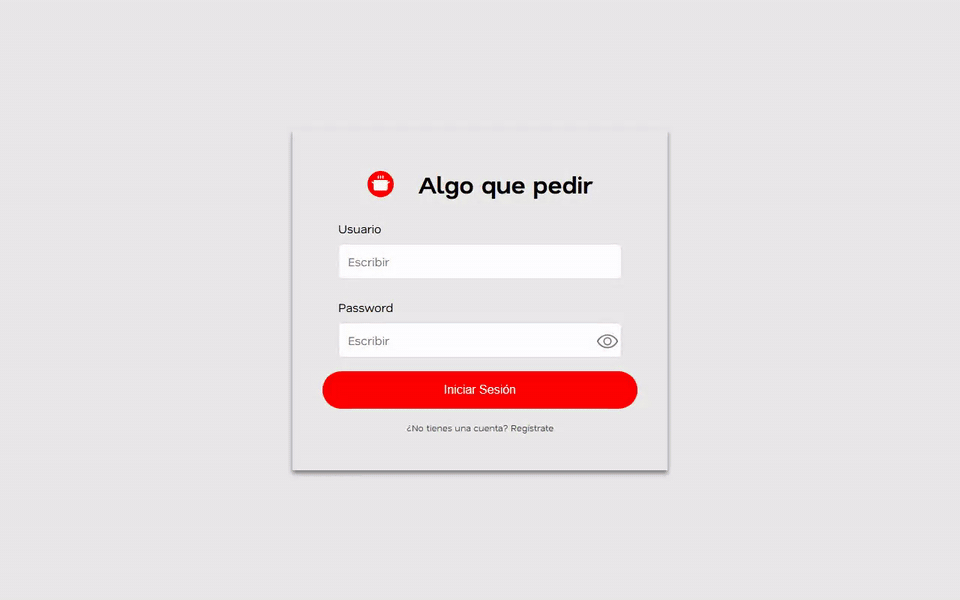
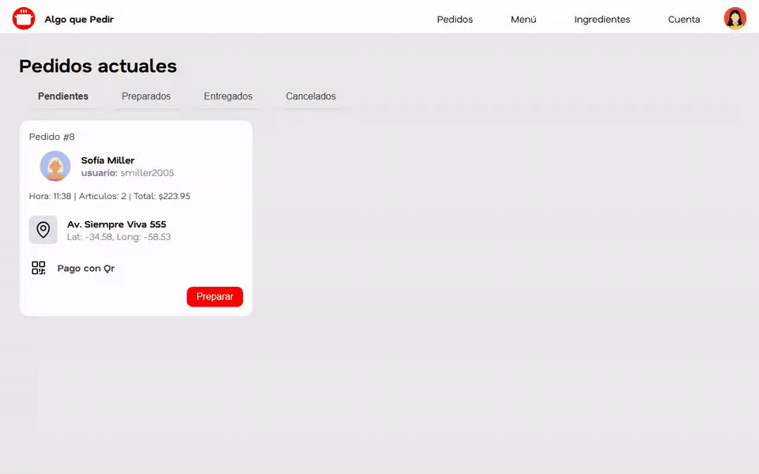
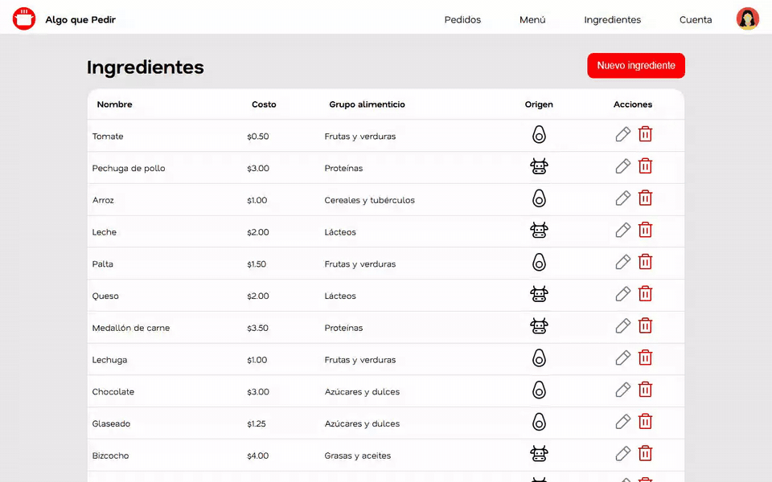
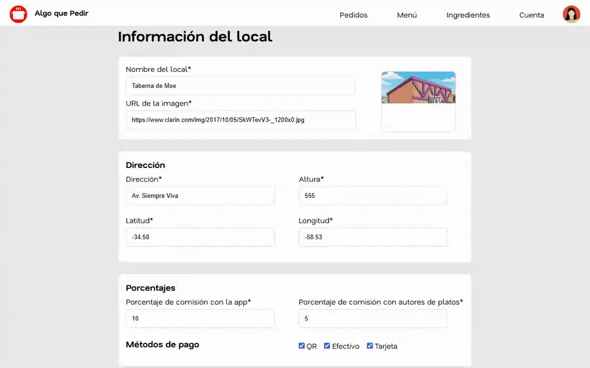
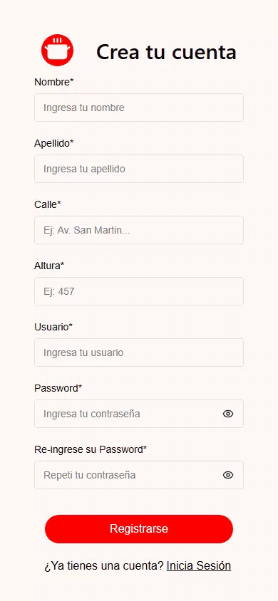
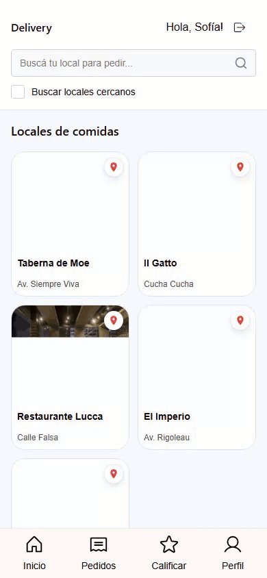
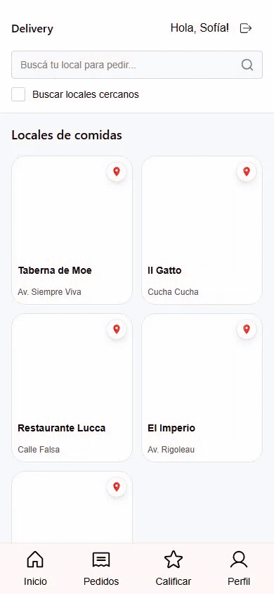
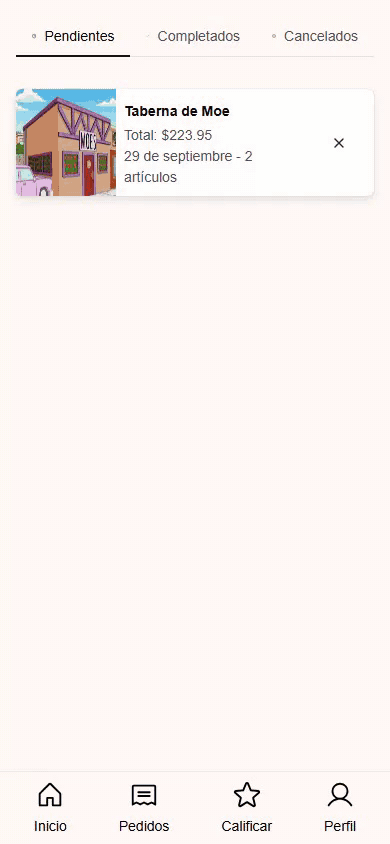
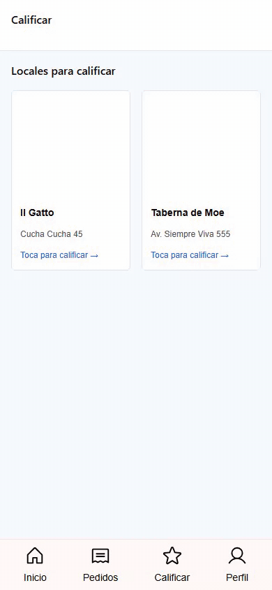

# Algo Que Pedir

[](https://github.com/solalcaraz/algo-que-pedir/actions/workflows/ci.yml)


App de pedidos de comida a domicilio con dos vistas: la del local, que gestiona pedidos, menú e ingredientes, y la del usuario, que busca locales, arma su pedido y lo califica. Es el trabajo práctico integrador de Algoritmos II y Algoritmos III de la Tecnicatura en Programación Informática de la UNSAM, que hicimos en equipo durante 2025. En el primer cuatrimestre modelamos el dominio y en el segundo le sumamos una API REST y los dos frontends.

## Problema que resuelve

La consigna describe una plataforma que conecta usuarios, locales y repartidores. Lo difícil no es el CRUD sino las reglas de negocio, que cambian entrega a entrega:

- El precio de un plato depende del costo de sus ingredientes, la comisión de la plataforma, las regalías si es de autor y un descuento que puede ser por plato nuevo (baja un punto por día) o por promoción, pero nunca los dos.
- Cada usuario elige qué platos acepta según un criterio (vegano, exquisito, conservador, fiel, marketing, impaciente) y los criterios se pueden combinar.
- Los repartidores aceptan pedidos con condiciones propias que también se combinan con AND y OR.
- Hay cupones con descuentos especiales distintos, acciones que el usuario agenda para ejecutar después y procesos de administración que avisan por mail.

El desafío técnico fue modelar todo eso para que sumar un tipo nuevo no obligue a tocar lo que ya funciona. En la segunda materia, el desafío pasó a ser exponer ese mismo dominio en una API REST y consumirla desde dos frontends hechos con tecnologías distintas sin duplicar la lógica de precios en el cliente.

## Demo

La app no tiene base de datos ni está pensada para producción: los datos se cargan en memoria al levantar el backend. Por eso la muestro en GIFs grabados en local, uno por funcionalidad.

**Vista del local (Svelte)**

| Funcionalidad | Demo |
|---|---|
| Pedidos por estado y cambio de estado |  |
| Detalle de un pedido |  |
| Menú y edición de un plato con sus ingredientes |  |
| Alta, edición y baja de ingredientes |  |
| Perfil del local |  |

**Vista del usuario (React)**

| Funcionalidad | Demo |
|---|---|
| Registro e inicio de sesión |  |
| Búsqueda de locales y filtro de cercanos |  |
| Armado del pedido y checkout |  |
| Mis pedidos y cancelación |  |
| Calificación de un local |  |
| Perfil, criterios de búsqueda e ingredientes |  |

## Tecnologías

| Parte | Stack |
|---|---|
| Backend (`backend/`) | Kotlin 1.9, Spring Boot 3.3, Java 21, Gradle, Kotest, MockK, JaCoCo |
| Vista del local (`frontend-local/`) | SvelteKit 2 con Svelte 5, TypeScript, Vite, Axios, Vitest y Testing Library. La maqueta previa está en HTML y CSS |
| Vista del usuario (`frontend-usuario/`) | React 19, TypeScript, Chakra UI 3, React Router 7, React Hook Form, Axios, Vite, Vitest y Testing Library |
| Integración continua | GitHub Actions: tests, lint y build de las tres partes |

## Cómo funciona

El backend tiene dos capas. El dominio (`backend/src/main/kotlin/*.kt`) es Kotlin puro y resuelve las reglas de la consigna: no sabe nada de HTTP. Encima está la API de Spring (`controller` → `service` → repositorios en memoria), que traduce entre el dominio y lo que necesita cada vista mediante DTOs. Al arrancar, `AppBootstrap` carga locales, platos, usuarios y pedidos de ejemplo.

Cada frontend consume esa API por su lado. La vista del local (Svelte) administra el negocio: pedidos, menú, ingredientes y datos del local. La vista del usuario (React) es mobile y cubre el recorrido del cliente, desde buscar un local hasta calificarlo.

En el dominio usamos patrones de diseño donde la consigna anunciaba cambios. Los criterios de usuario, las condiciones de delivery y la puntuación de locales son Strategy, y sus combinaciones son Composite. Los cupones usan Template Method: las condiciones comunes viven en la clase base y cada cupón define la suya. Lo que pasa al confirmar un pedido (publicidad, auditoría, aviso al local) son Observers, y las acciones que el usuario agenda son Command. Cada vez que la consigna dice "pueden aparecer nuevos", hay una interfaz y una clase nueva, no un `if` más. En la API, el precio lo calcula siempre el backend: el checkout de React muestra el desglose, pero al confirmar se recalcula el total y el pedido se rechaza si no coincide con el que mandó el front.

Las decisiones que tomé y por qué:

- **Los criterios de búsqueda viajan como un DTO con tipo y subcriterios.** El front no puede mandar objetos con comportamiento, así que el usuario manda un `CriterioDTO` con un tipo (`VEGANO`, `FIEL`, `COMBINADO`...) y sus datos, y el backend lo convierte en la Strategy del dominio. Los subcriterios anidados reflejan el Composite del modelo.
- **Solo el local dueño puede editar un plato.** No hay autenticación con tokens, así que el front manda el id del local logueado y el service rechaza la edición si el plato es de otro local.
- **Las imágenes de los platos las sirve el backend.** El formulario de plato elige entre las imágenes que ya están en el servidor en vez de subir archivos, así no hubo que resolver almacenamiento y las rutas del front y del back no se desincronizan.
- **Validaciones del perfil de usuario con Strategy y Composite.** Cada regla (texto requerido, valor positivo, rango) es una estrategia y un campo puede combinar varias. Así el mismo componente de input sirve para todos los campos del formulario.
- **Un solo repositorio para las tres partes.** Originalmente eran tres repos privados de la cátedra. Los junté conservando el historial completo de cada uno para que el sistema se pueda ver y correr desde un solo lugar.

## Cómo correrlo

Necesitás JDK 21, Node 22 y Yarn 1.

```bash
git clone https://github.com/solalcaraz/algo-que-pedir.git
cd algo-que-pedir
```

**Backend** (queda escuchando en `http://localhost:9000`):

```bash
cd backend
./gradlew bootRun
```

**Vista del local** (en otra terminal):

```bash
cd frontend-local
yarn install
yarn dev
```

**Vista del usuario** (en otra terminal):

```bash
cd frontend-usuario
npm install
npm run dev
```

Vite levanta la primera app en `http://localhost:5173` y la segunda en el siguiente puerto libre.

Usuarios de prueba que carga el backend:

| Vista | Usuario | Contraseña |
|---|---|---|
| Local | `local1` (Taberna de Moe) | `local1` |
| Usuario | `smiller2005` | `123` |

Para correr los tests: `./gradlew test` en `backend`, `yarn test:unit --run` en `frontend-local` y `npx vitest run` en `frontend-usuario`.

## Qué aprendí y qué mejoraría

**Qué aprendí**

Fue mi primer proyecto largo y el más parecido a un sistema real. Antes de este TP nunca había conectado un front con una API ni había trabajado en algo de este tamaño. Lo técnico, de lo más básico a lo más complejo:

- Modelar un dominio con objetos y tests desde cero, y aplicar patrones de diseño donde el enunciado anunciaba que iban a aparecer casos nuevos.
- Llevar ese modelo a una API REST con Spring Boot: controllers, services, DTOs y manejo de errores.
- Maquetar en HTML y CSS, pasar esas pantallas a componentes en Svelte y en React, y conectarlas con la API.
- Armar un sistema de validaciones generales con Strategy en React. Los profes lo destacaron en la corrección y me sirvió para entender los patrones fuera del dominio.

También aprendí a trabajar en equipo con Git: pull requests documentados con el trabajo hecho y ramas con un propósito, no con el nombre de cada uno. Nos organizamos con Trello y dividimos las tareas por funcionalidad. Además de mi parte, fui la referente del grupo ante los tutores, así que me tocó coordinar un equipo grande.

Algoritmos II me costó mucho, sobre todo el backend y la lógica. Para Algoritmos III cambié la forma de encararlo: investigué más, me involucré más y aprendí a leer documentación y a usarla para practicar. Svelte, por ejemplo, tiene ejercicios interactivos en su documentación que me ayudaron a entender rápido lo que necesitaba.

**Qué mejoraría**

- Persistencia real: hoy todo vive en memoria y se pierde al reiniciar el backend.
- Autenticación: las contraseñas se guardan con un hash que no es criptográfico (`cyrb53`) y la sesión es un id guardado en el navegador, sin token. Usaría Spring Security con bcrypt y JWT.
- Configuración: la URL del backend y los orígenes de CORS están escritos en el código; los pasaría a variables de entorno.
- El detalle del pedido en la vista del usuario no muestra la distancia al local, porque ese endpoint no la devuelve.
- La vista del usuario tiene poca cobertura de tests (14% de líneas, contra 77% del backend y 65% de la vista del local).

## Autoría y mejoras

Este repositorio es el original del trabajo práctico integrador que hicimos en equipo entre marzo y noviembre de 2025. El tag [`tp-original-2025`](https://github.com/solalcaraz/algo-que-pedir/tree/tp-original-2025) marca el TP tal como lo entregamos.

**Equipo:** María Sol Alcaraz, Facundo Casado (Algoritmos II), Joaquín Navarro, Damián Palomba, David Pazos (Algoritmos III) y Carla Rocca.

**Mi parte en la versión original**:

- En Algoritmos II, los tipos de usuario y los cupones del dominio.
- En la maqueta HTML y CSS, la vista de edición de plato y los estilos de botones, switch e inputs.
- En la vista del local (Svelte), los componentes de botón e input, el modelo de plato con sus validaciones, las vistas de menú y edición de plato conectadas al backend, y el modal de ingredientes del plato. Integré el componente tabla en la edición de plato y le sumé la fila extra para agregar ingredientes. También los tests de esas vistas.
- En la API, el CRUD de platos (con la validación de que solo lo edita su local y las imágenes servidas desde el backend) y los endpoints de usuario, incluida la conversión de criterios entre el front y el dominio.
- En la vista del usuario (React), el perfil: datos personales, criterios de búsqueda e ingredientes preferidos y a evitar.
- También en React, un sistema de validaciones generales con Strategy y Composite, con el input que las usa, y los tests del botón, las validaciones y los modelos.

**Lo que hice después**:

- Junté los tres repositorios en uno, conservando el historial de cada uno, y sumé un CI que prueba y compila las tres partes.
- Arreglé los tests del backend, que no compilaban, y el build de las dos vistas, que fallaba.
- Corregí los 18 errores de tipos que `svelte-check` marcaba en los tests de la vista del local y sumé ese chequeo al CI.
- Corregí que el perfil del local no guardara Efectivo ni Tarjeta como medios de pago y se rompiera en los locales que no aceptan todos.
- Corregí que recargar el perfil del local mandara al login.
- Corregí que el error de dirección vacía apareciera debajo del nombre del local.
- Corregí un import con una mayúscula distinta al nombre del archivo, que rompía el build de la vista del local en Linux.
- Corregí que la lista de pedidos del usuario consultara al usuario 0 hasta recargar la página después del login.
- Corregí que la distancia máxima del criterio Impaciente no se guardara.
- Corregí el botón para cerrar la calificación de un local, que mandaba al login.
- Corregí el link Calificar del footer, que también mandaba al login.
- Corregí que eliminar un ingrediente prohibido lo sacara de preferidos.
- Corregí que el criterio Fiel no aceptara ningún plato.
- Corregí el desglose del pedido que ve el local, que no sumaba el total en pagos con QR o tarjeta.
- Corregí que el dueño de un plato no pudiera editarlo si el id del local era mayor a 127.
- Corregí que el local El Imperio compartiera usuario con otro y no se pudiera entrar con él.
- Corregí el CORS de dos controllers, que impedía usar las dos vistas a la vez.
- Corregí que la validación del descuento de un plato mostrara el mismo error dos veces.
- Hice que el registro de un local avise que salió bien y lleve al login; antes no mostraba nada.
- Conecté la cantidad de pedidos del local, que la vista del usuario mostraba siempre en 0 porque el backend no la enviaba.
- Recuperé la maqueta HTML completa y arreglé sus rutas rotas a estilos e imágenes.
- Saqué código muerto y comentado, dejé solo los comentarios que explican un porqué y unifiqué la validación de los modelos de la vista del local.
- Grabé la demo y escribí este README.

Para verificar que el comportamiento no cambió corrí los tests de las tres partes antes y después: los 219 del backend siguen pasando y sumé 5; en la vista del local pasé de 140 a 266, porque volvieron a correr seis archivos que no cargaban y sumé tests nuevos; en la del usuario, de 50 a 55. También comparé las respuestas de 33 endpoints de la API contra el original y solo cambiaron las dos que corrige el arreglo del desglose.
